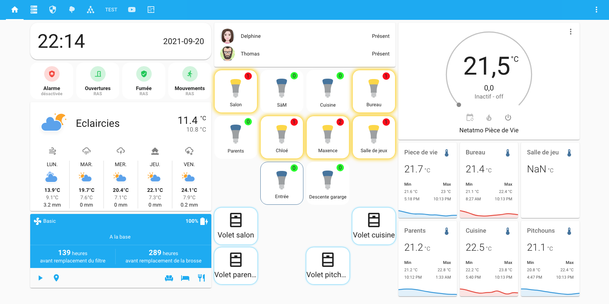
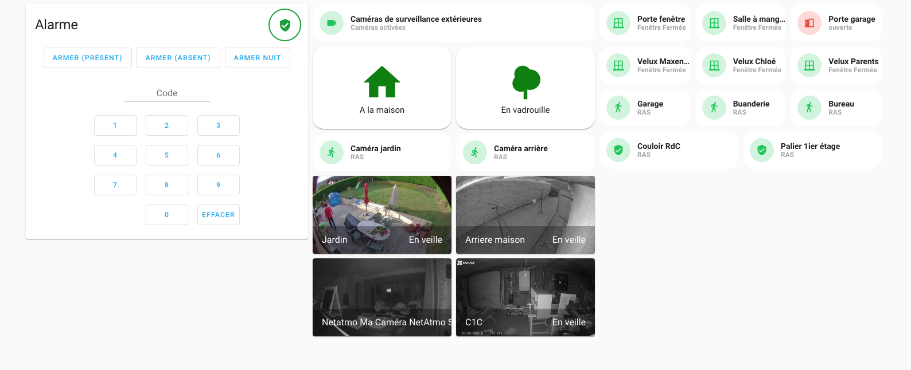
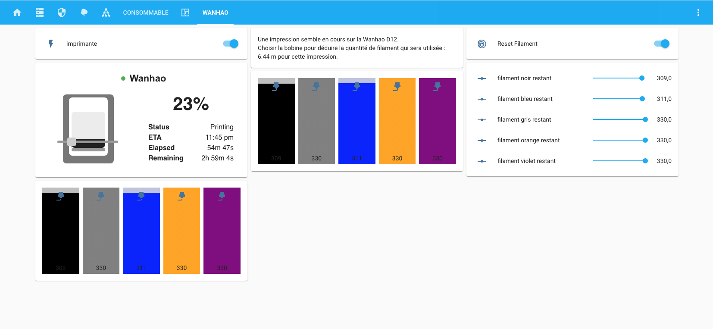

# Ma configuration Home Assistant
Il s'agit de ma configuration [Home Assistant](https://home-assistant.io) tournant sur un petit serveur NUC sous Ubuntu 20.04 LTS.
Si cela vous intéresse et si vous voulez suivre l'évolution de mon installation n'oubliez pas de cliquer sur ⭐️ .

Dans un premier temps l'idée est de proposer un tableau de bord utilisé principalement sur un ordinateur car c'est à partir de mon ordinateur que je mets tout en place. Après ce tableau de bord sera adapté pour être plus agréable à utiliser sur un smartphone ou encore sur une tablette qui pourra être au coeur de la maison et à partir de laquelle il sera possible de tout controller.

Mon tableau de bord s'articule donc autour de plusieurs vues : un tableau principal où j'ai placé les informations qui sont primordiales pour la famille et les quelques actions que l'on fait quotidiennement ou presque.

Ensuite une vue qui n'est utile qu'à moi et qui n'est d'ailleurs visible que de moi : la partie système qui me permet d'avoir un visuel immédiat sur le serveur hébergeant le système domotique, l'état de santé de Home Assistant ainsi que des conteneurs qui tournent sur mon serveur et qui sont principalement en lien avec Home Assistant.

Une vue importante : celle qui concerne la sécurité avec l'affichage des diiférentes caméras mais aussi un retour des différents capteurs.

Une vue qui a fait son apparition dernièrement : celle pour contrôler mon imprimante 3D. En effet celle-ci est raccordée à une prise connectée qui me permet de l'allumer et surtout de l'éteindre à la fin d'une impression. Je peux aussi faire un suivi relativement fin de la quantité de filaments encore en stock.

### Mais où est le code ?
Ca arrive au fur et à mesure. Je suis entrain de mettre en ligne les différents fichiers et j'espère que tout sera en place d'ici quelques semaines. Cela fait maintenant plus d'un an que j'utilise Home Assistant et je veux partager avec vous ma configuration. J'essaie de faire ça le mieux possible toujours en documentant mon travail et en versionnant mes mises à jour. Je garderais ainsi un historique de mes modifications.

### Et à propos de mon installation ?

Voici une partie de mon matériel :
- Clé USB Conbee II pour me passer de la plupart des passerelles Zigbee;
- Clé USB Aeotec Z-Wave Plus Z-Stick Gen5 pour centraliser tous les équipements Z-Wave;
- Phillips Hue avec pont et Ligthstrip, spots GU10 x4, ampoules E27 x6;
- Ikea Tradfri spots GU10 x4;
- Station météo NetAtmo avec pluviomètre
- Capteurs température Aqara x4
- Détecteurs mouvement Aqara;
- Détecteurs de mouvement Aeotec x2;
- Détecteurs ouverture porte Aqara;
- Détecteurs ouverture porte Aeotec x2;
- Prise connectées Osram x3;
- Robot aspirateur Dreame D9;
- Détecteur de fumée Fibaro x2.

Et pour la partie plus « IT » :
- Un rack 15U dans le garage;
- UniFi UDM Pro;
- Switch D-Link 24 que je pense remplacer par un switch Unifi prochainement;
- Access Point UniFi AC-Lite;
- NUC Intel NUC8i3BEH 16GB;
- NAS Synology DS418j;
- Onduleur Eaton Ellipse Pro 650.
