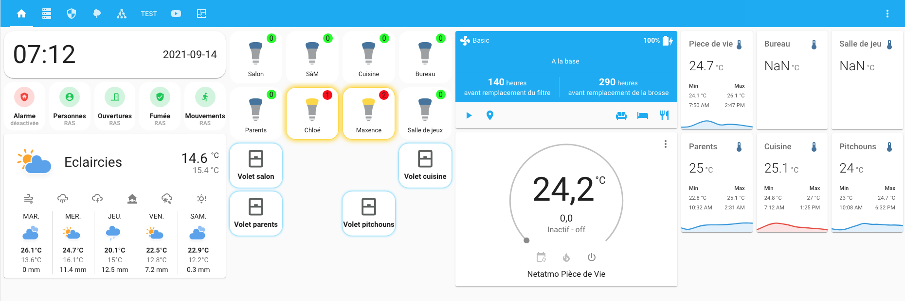
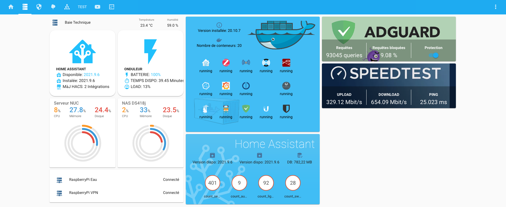

# Ma configuration Home Assistant
Il s'agit de ma configuration [Home Assistant](https://home-assistant.io) tournant sur un petit serveur NUC sous Ubuntu 20.04 LTS.
Si cela vous intéresse et si vous voulez suivre l'évolution de mon installation n'oubliez pas de cliquer sur ⭐️ .

### Mais où est le code ?
Ca arrive. Cela fait maintenant plus d'un an que j'utilise Home Assistant et je veux partager avec vous ma configuration. Pour le moment mes fichiers de configuration sont en cours de nettoyage pour rendre ce partage possible. Mais je transfére petit à petit ces fichiers ici même. J'essaie de faire ça le mieux possible toujours en documentant mon travail et en versionnant mes mises à jour. Je garderais ainsi un historique de mes modifications.

### Et à propos de mon installation ?
C'est également dans ma liste de choses à faire. Je suis en train de mettre tout à plat et je le partagerais ici très prochainement.
