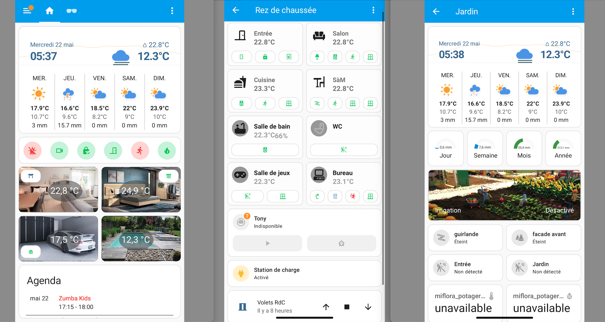

# Ma configuration Home Assistant
Il s'agit de ma configuration [Home Assistant](https://home-assistant.io) qui tourne desormais sur un cluster Proxmox.
Si cela vous intéresse et si vous voulez suivre l'évolution de mon installation n'oubliez pas de cliquer sur ⭐️ .

Dans un premier temps l'idée est de proposer un tableau de bord utilisé principalement sur un smartphone car au fil du temps je me suis aperçu que c'est via mon smartphone que j'utilise le plus Home Assistant. Je n'utilise l'ordinateur que lorsque je veux faire des installations ou des modifications. Dans le futur, l'idée sera d'adapter ce tableau de bord pour être plus agréable à utiliser sur une tablette. Celle serait alors au coeur de la maison et à partir de celle-ci il sera possible de tout controller.

Mon tableau de bord s'articule donc autour de plusieurs vues : un tableau principal où j'ai placé les informations qui sont primordiales pour la famille et les quelques actions que l'on fait quotidiennement ou presque.

### Mais où est le code ?
Je suis en mode UI c'est à dire que mon tableau de bord est réalisé directement à partir de l'interface de Home Assistant. J'avais réalisé mes premiers tableaux de bord en mode YAML mais les dernières versions de Home Assistant me permettent de faire la même chose directement à partir de l'interface ce qui simplifie grandement les choses. Je partage donc mon tableau de bord en faisant un export de l'éditeur de configuration. Vous pouvez retrouver le code complet dans le fichier [export-lovelace.yaml](https://github.com/journaldethomas/home-assistant-config/blob/master/export-lovelace.yaml)

Pour ce qui est de la configuration à proprement parlé avec la définition de mes sensors, des templates et des différentes informations que je souhaite connaitre sur mon système domotique, vous trouverez une petite partier dans le fichier [configuration.yaml](https://github.com/journaldethomas/home-assistant-config/blob/master/configuration.yaml). Mais depuis plusieurs mois je scinde de plus en plus ce fichier de configuration et je vais donc mettre les différentes fichiers à disposition prochainement.

Cela fait maintenant bientôt 4 ans que j'utilise Home Assistant et je veux partager avec vous ma configuration complète. J'essaie de faire ça le mieux possible toujours en documentant mon travail et en versionnant mes mises à jour. Je garderais ainsi un historique de mes modifications.

### Et à propos de mon installation ?

Voici une partie de mon matériel :
- [Clé USB Conbee II](https://amzn.to/3vQXMM1) pour me passer de la plupart des passerelles Zigbee;
- Clé USB Aeotec Z-Wave Plus Z-Stick Gen5 pour centraliser tous les équipements Z-Wave;
- Phillips Hue avec pont et lightstrip, spots GU10 x4, ampoules E27 x7, [plafonnier Enrave](https://amzn.to/3K9EvJN);
- InnR [spots GU10](https://amzn.to/4dRYSJ6) x9, [lightstrip](https://bit.ly/3XmydMo);
- [Station météo NetAtmo](https://amzn.to/3SlrUXk) avec pluviomètre;
- Capteurs température Aqara x4 / Sonoff x5 / Heiman x2 / Nous x2;
- Détecteurs mouvement Aqara x3;
- Détecteur de mouvement Aqara FP1;
- Détecteurs de mouvement Aeotec x2;
- Détecteurs ouverture porte Aqara;
- Détecteurs ouverture porte Aeotec x2;
- Module Z-Wave Fibaro FGD-212;
- Prise connectées Osram x3;
- Prise connectée SmaBit;
- Robot aspirateur Dreame D9;
- Détecteur de fumée Fibaro x2;
- Détecteur de fumée Heiman.

Et pour la partie plus « IT » :
- Un rack 15U dans le garage;
- UniFi UDM Pro;
- Switch Unifi 24 ports POE;
- Access Point UniFi AC-Lite;
- 2x [HP EliteDesk 800 G2](https://amzn.to/3uavDiH);
- NAS Synology DS418j;
- Onduleur Eaton Ellipse Pro 650.
